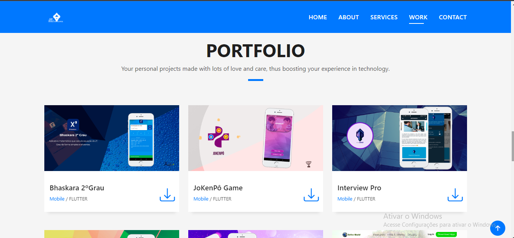

<h1 align="center">
    
    
Panzo - Portfolio

</h1>

## About

This is a profissional portfolio, made with love to learn html5, css3 and javascript. With information of authors.
***
***

***
- Panzo - Portfolio <a href="https://josuepanzo.github.io/panzo-portfolio/" target="_blank">Go to Site</a>

***
***
***
***
## 🔨 Tools

- Html5
- Css3
- Javascript
- Bootstrap

***
***
***
***
## ❄ How To Use
***

1 - When you access the project, you can see this page about dev.

   

2 - After you can see this page about services.

   

3 - There is also this page that show the portfolio or project.

   

4 - Finally we have this page contact page

   
   

***
***
***
***
## 🙍‍♂️ Authors

  **Josué António Dias Panzo**
  ***
  - My - <a href="https://www.linkedin.com/in/josuepanzo5/" target="_blank">Linkedin</a>

Please follow github

Thanks to visiting me and good coding!
***
***
***
***
## 🧧 Licenses
***
This project is under the **MIT License**. See the file **LICENSE** for more details.